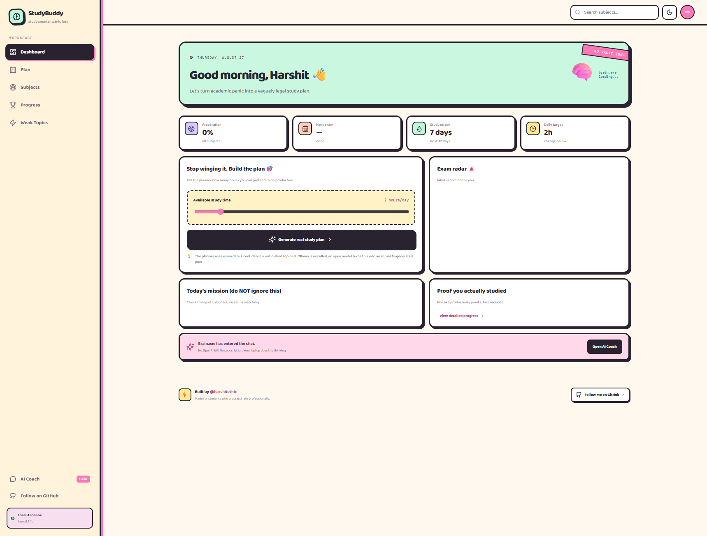
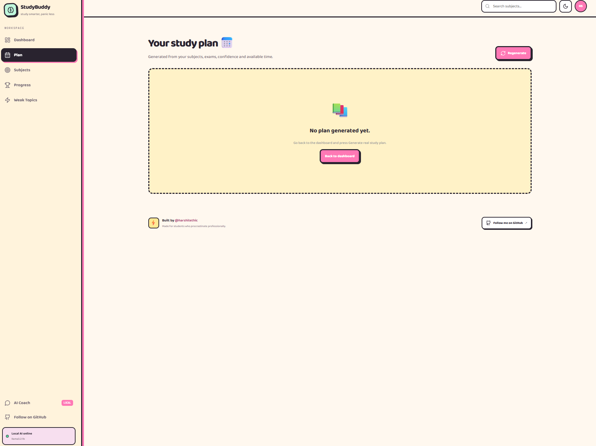
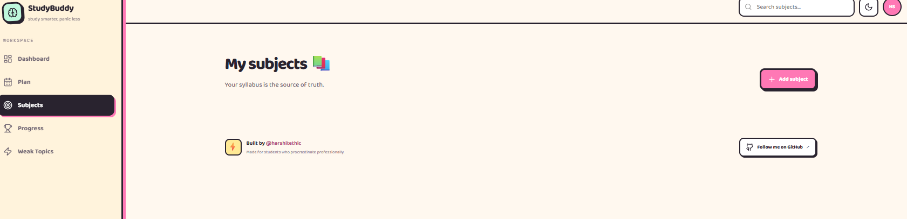
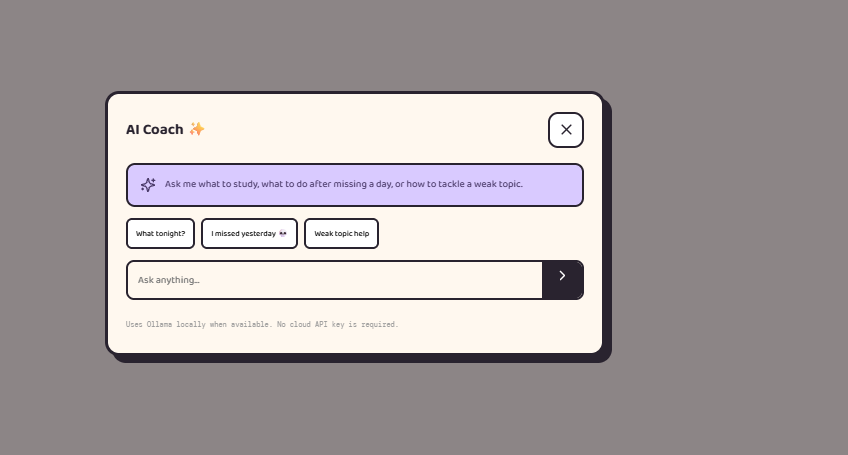

# 📚 StudyBuddy

### The study planner for students who said “I'll start tomorrow” 14 times.

**StudyBuddy** is a free, open-source, web-based AI study planner built specifically for college students.

It helps students organize subjects, exam dates, syllabus topics, available study time, and preparation confidence into a practical study workflow.

Instead of being another basic to-do list, StudyBuddy combines **study planning + progress tracking + weak-topic detection + local AI assistance** in one simple application.

> **Built by [@harshitethic](https://github.com/harshitethic) for students. ❤️**

---

## ✨ What is StudyBuddy?

College students usually have the same problem:

- Too many subjects
- Multiple exams
- No idea what to study first
- Weak topics discovered too late
- Unrealistic study schedules
- Missing one day and then abandoning the entire plan
- AI tools that require paid API keys

StudyBuddy is designed to solve that.

You enter your:

- Subjects
- Exam dates
- Topics
- Difficulty
- Confidence level
- Available study hours

StudyBuddy then helps you decide **what to study, when to study it, and what needs the most attention**.

The application can work without a paid AI service, and it can optionally use **Ollama with an open-source/local model** for actual AI responses.

---

# 🧠 Main Features

## 1. 🎯 Smart Study Planning

StudyBuddy generates a 7-day study plan based on your actual academic situation.

The planner considers:

### Exam proximity

Subjects with exams coming sooner receive higher priority.

### Confidence

If you are less confident in a subject, the planner gives it more attention.

### Unfinished topics

Topics you haven't completed are automatically considered when creating the plan.

### Difficulty

Hard subjects can receive more focused study blocks.

### Available time

You tell StudyBuddy how many hours you realistically have each day.

The goal is not:

> “Study 12 hours today bro.”

The goal is:

> “You have 3 hours. Here's what gives you the best return.”

---

# 🤖 2. Local AI — No Paid API Required

StudyBuddy supports **Ollama**, allowing AI features to run locally on your own computer.

This means you don't need:

- OpenAI API
- Gemini API
- Claude API
- A paid subscription
- A credit card
- A cloud AI account

When Ollama is available, StudyBuddy can use a local model for:

- AI-generated study plans
- AI Coach responses
- AI-generated quizzes

The default model used by the project is:

**Llama 3.2 1B**

You can change the model later to another Ollama-compatible model.

### Why local AI?

For a student project, local AI has several advantages:

- No API bills
- No API key management
- Better privacy
- Easy to demonstrate offline
- Students can experiment with different open models
- The project doesn't depend completely on one company

---

# ⚙️ 3. Smart Fallback System

This is an important part of the project.

StudyBuddy does **not** completely break when AI is unavailable.

If Ollama isn't running, the application uses its built-in planning algorithm.

That algorithm still considers:

- Exam dates
- Confidence
- Difficulty
- Completed topics
- Remaining topics
- Available study time

So there are effectively two planning modes:

### Local AI mode

```text
Student data
     ↓
StudyBuddy backend
     ↓
Ollama
     ↓
Local open model
     ↓
AI study plan
```

### Fallback mode

```text
Student data
     ↓
StudyBuddy backend
     ↓
Priority algorithm
     ↓
Study plan
```

This makes the application much more reliable than a project that simply says:

> “Enter your API key to continue.”

---

# 📚 4. Subject Management

Students can create their own subjects.

Each subject can contain:

- Subject name
- Short name
- Exam date
- Difficulty
- Confidence
- Individual syllabus topics

For example:

```text
Computer Networks

Exam:
15 September

Difficulty:
Hard

Confidence:
41%

Topics:
• TCP/IP
• Routing
• DNS
• HTTP
```

This information becomes the foundation for the planner.

---

# ✅ 5. Topic-Level Progress Tracking

StudyBuddy tracks individual topics instead of pretending that:

> “I opened the textbook”

means

> “I studied the subject.”

Each topic can be marked as completed.

For example:

```text
DBMS

☑ Normalization
☑ Transactions
☐ Indexing
☐ SQL Joins
```

The application calculates subject progress from the actual topic checklist.

---

# 🫠 6. Weak Topic Detection

StudyBuddy identifies topics that need more attention.

Weak topics can be surfaced using:

- Low confidence
- Incomplete topics
- Subject difficulty
- Exam proximity

This gives the planner a more useful priority system.

Instead of spending another hour on a chapter you already understand, the system can push you toward the topic you keep avoiding.

---

# 💬 7. AI Coach

The AI Coach is designed like a study assistant rather than a generic chatbot.

You can ask things like:

> What should I study tonight?

> I missed yesterday. Fix my plan.

> How should I study my weakest topic?

> Which subject should I prioritize?

The Coach receives the relevant study context from StudyBuddy, including subjects, exam dates, confidence, and weak topics.

When Ollama is available, the answer is generated locally.

If AI is unavailable, StudyBuddy provides a basic fallback response instead of leaving the feature completely unusable.

---

# 📝 8. AI Quiz Generation

The backend also includes a quiz-generation endpoint.

The idea is simple:

```text
Subject
   +
Topics
   ↓
Local AI
   ↓
Multiple-choice questions
   ↓
Answer + explanation
```

This can be extended into a full quiz interface where students can:

- Answer questions
- Track scores
- Identify weak concepts
- Repeat incorrect questions
- Build a revision history

---

# 📈 9. Progress Dashboard

The dashboard provides a quick overview of preparation.

It includes:

- Overall preparation
- Next exam
- Study streak
- Daily study target
- Subject progress
- Topic completion
- Weak areas

The goal is to make the important information visible without forcing students through complicated screens.

---

# 💾 10. Local Data Persistence

StudyBuddy stores student progress in the browser using **localStorage**.

This means the application remembers:

- Subjects
- Topics
- Completed topics
- Exam dates
- Preparation data

No external database is required for the basic project.

This makes the project extremely easy for students to understand and demonstrate.

---

# 🌙 11. Dark & Light Mode

StudyBuddy includes both:

- Light mode
- Dark mode

The theme preference is also remembered in the browser.

Because apparently some students only become productive after midnight.

---

# 📱 12. Responsive Design

The interface is designed to work across:

- Desktop
- Laptop
- Tablet
- Mobile

The mobile layout adapts the navigation, cards, dashboard and study information so the project remains usable on smaller screens.

---

# 🎨 Design Philosophy

StudyBuddy intentionally uses a playful, cartoonish and meme-inspired visual style.

The idea is to make a college productivity application feel less like:

> “Corporate Enterprise Student Management Portal 3000”

and more like something a student would actually want to open.

The interface uses:

- Rounded cards
- Chunky borders
- Playful copy
- Cartoon-like visual elements
- Strong visual hierarchy
- Dark/light themes
- Meme-style microcopy

The humor is there to make studying slightly less painful, not to get in the way of the actual functionality.

---

# 🖼️ Screenshots

## Dashboard



The dashboard provides the student's main overview, including preparation, upcoming exams, daily targets, subjects and study tasks.

---

## Study Plan



The study-plan screen turns the student's academic data into a structured multi-day schedule.

---

## Mobile



The responsive interface makes the application usable on phones as well as desktop screens.

---

## AI Coach



The AI Coach gives students a conversational way to ask for study advice and recover when they fall behind.

---

# 🏗️ How the Project Works

StudyBuddy is split into three major parts.

## Frontend

The frontend is built using:

- React
- Vite
- Lucide React
- CSS

The frontend handles:

- Dashboard
- Subject management
- Progress tracking
- Study-plan display
- AI Coach interface
- Theme switching
- User interaction

---

## Backend

The backend uses:

- Node.js
- Express

It provides API endpoints for the application's intelligent features.

The backend acts as the middle layer between the browser and Ollama.

This is useful because it keeps the frontend architecture clean and allows the AI provider/model to be changed without rebuilding the entire UI.

---

## AI Layer

The AI layer uses:

**Ollama + local open models**

The default model is:

**Llama 3.2 1B**

The architecture is intentionally provider-independent.

The project can later be extended to support other local or hosted inference providers without rewriting the entire application.

---

# 🔌 Backend API Overview

The project contains several API endpoints.

## Health

`GET /api/health`

Used to determine whether Ollama is available and which models are installed.

---

## Study Plan

`POST /api/plan`

Receives:

- Subjects
- Exam dates
- Confidence
- Topics
- Available hours
- Number of days

Returns a structured study plan.

---

## AI Coach

`POST /api/coach`

Receives:

- Student question
- Subject context
- Exam information
- Weak topics

Returns a study-coach response.

---

## Quiz Generator

`POST /api/quiz`

Receives:

- Subject
- Topics
- Requested question count

Returns generated multiple-choice questions with answers and explanations.

---

# 📂 Project Structure

```text
studybuddy/
│
├── src/
│   ├── main.jsx
│   └── styles.css
│
├── server/
│   └── index.js
│
├── screenshots/
│   ├── dashboard.png
│   ├── study-plan.png
│   ├── mobile.png
│   └── ai-coach.png
│
├── .github/
│   └── ISSUE_TEMPLATE/
│       └── bug_report.md
│
├── index.html
├── vite.config.js
├── package.json
├── .env.example
├── .gitignore
├── CONTRIBUTING.md
├── LICENSE
└── README.md
```

---

# 🧑‍🎓 Why This Is a Good College Project

StudyBuddy demonstrates multiple areas of software development in one application.

### Frontend development

React-based UI with reusable components and responsive layouts.

### Backend development

Express REST API connecting the frontend to intelligent services.

### Artificial intelligence

Local LLM integration through Ollama.

### Algorithms

Priority-based study scheduling when AI isn't available.

### Data handling

Persistent student progress through browser storage.

### UX design

Responsive and student-focused interface.

### Error handling

AI fallback logic prevents the entire application from becoming unusable.

### Open-source development

The repository includes:

- MIT license
- Contribution guidelines
- Issue template
- Environment example
- Documentation
- Screenshots

This makes it suitable not only as a college submission but also as a GitHub portfolio project.

---

# 🧪 Important Design Decision

A common mistake in student AI projects is:

```text
Frontend
   ↓
Paid AI API
   ↓
Error
   ↓
Project dead
```

StudyBuddy intentionally avoids that architecture.

Instead:

```text
              ┌── Local AI ──┐
Student data ─┤              ├── Study plan
              └─ Algorithm ──┘
```

If AI works, use AI.

If AI doesn't work, use the planner.

The student still gets a functioning application.

---

# 🔐 Privacy

When using Ollama locally, AI requests are processed through the student's own machine.

StudyBuddy does not require students to send their study information to a paid cloud AI provider.

Basic application data is stored locally in the browser.

---

# 🚀 Future Ideas

The current project can be expanded significantly.

Possible improvements include:

- User authentication
- SQLite or PostgreSQL
- Cloud sync
- Google Calendar integration
- Pomodoro timer
- Spaced repetition
- Syllabus PDF upload
- Automatic topic extraction
- Voice-based AI Coach
- Study analytics
- Weekly reports
- Notifications
- Exam countdown widgets
- Teacher/admin dashboard
- Shared study groups
- Leaderboards
- AI-generated flashcards
- Automatic revision scheduling
- Difficulty prediction
- Historical performance analysis

---

# 🤝 Contributing

Contributions are welcome.

If you find a bug, have an idea, or want to improve the application, open an issue or pull request.

Please keep contributions aligned with the project's main principles:

- Free to use
- Student-friendly
- No unnecessary paid dependencies
- Responsive
- Simple to understand
- AI should have a fallback where practical

See `CONTRIBUTING.md` for more information.

---

# 📜 License

StudyBuddy is released under the **MIT License**.

You can find the full license in `LICENSE`.

---

# 👨‍💻 Built by @harshitethic

## Harshit Ethic

**Developer • Builder • Problem Solver**

StudyBuddy was built as an open-source project for college students who want a useful project they can actually understand, run and extend.

GitHub:

**https://github.com/harshitethic**

If you find StudyBuddy useful, consider giving the repository a ⭐ and following **@harshitethic** for more open-source student projects.

---

## ❤️ Built for students

No:

- ❌ Paid API required
- ❌ Complicated cloud setup
- ❌ Mandatory database
- ❌ Subscription
- ❌ Fake AI buttons

Instead:

- ✅ Real study planning
- ✅ Real progress tracking
- ✅ Real weak-topic detection
- ✅ Optional local AI
- ✅ Smart fallback
- ✅ Open-source
- ✅ Student-friendly

> **Study smarter. Panic slightly less. 💀📚**
